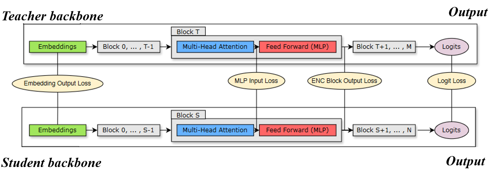

<div align="center"> 

<a href="https://github.com/OD-FinLLM/" target="_blank"></a>

[](https://github.com/Firefly-Tech) [](./) [](./)

[](https://github.com/OD-FinLLM/LICENSE) [](./)

[](https://git.io/typing-svg)

</div>


# OD-FinLLM (On-Device Financial Large Language Model)
### OD-FinLLM: A Specialized Model for Chinese Financial Knowledge, Developed by Firefly

OD-FinLLM is a refined model derived from the LLaMA series, with specific enhancements for Chinese financial knowledge. This model is built by fine-tuning LLaMA using a specialized instruction dataset created from publicly available Chinese financial Q&A data and additional web-scraped financial information, leading to superior performance in financial-related queries.


## 🎥 Demo
The following is a demonstration video of OD-FinLLM, demonstrating the application performance of the model in Chinese financial Q&A scenarios. You can watch the embedded video directly here:

<video width="80%" controls> <source src="./web_demo/assets/OD-FinLLM.mp4" type="video/mp4"> Your browser does not support video playback. </video>

## 🔄 Latest Updates

- **[2024/08/24]**: Released a fine-tuned model based on LLaMA and web demo codebase.

## 🚀 Quick Installation

Start by installing the necessary dependencies. It is recommended to use Python version 3.9 or above.

```bash
pip install -r requirements.txt
```

### 🤖 Model Availability

You can download the models' weights via Huggingface. The file structure is as follows:

| Model Download Link | Type | Base Model | Training Data | Sequence Length | Version |
|---------------------|------|------------|---------------|-----------------|---------|
| [OD-FinLLM-LLaMA-7B](https://huggingface.co/FireFlyCourageous/OD-FinLLM-LLaMA-7B) | Chinese Financial Q&A Fine-Tuned Model | meta-llama/Llama-2-7b-chat-hf | Instruction Data | 512 | V1.0 |
| [OD-FinLLM-LLaMA-8B](https://huggingface.co/FireFlyCourageous/OD-FinLLM-LLaMA-8B) | Chinese Financial Q&A Fine-Tuned Model | meta-llama/Meta-Llama-3.1-8B-Instruct | Instruction Data | 512 | V1.0 |

### Inference Process


To run inference:

```bash
cd OD-FinLLM
sh run.sh
```


### Web Demo Process

To run web demo:

```bash
python web_demo.py
```

### 📊 Data Construction

Earlier versions of OD-FinLLM utilized **publicly available and scraped Chinese financial Q&A data**, covering topics such as insurance, wealth management, stocks, funds, loans, credit cards, social security, and more.

Example of instruction data:

```
Question: 招商银行e招贷逾期了怎么办？

Answer: 如果你的招商银行e招贷贷款已经逾期了，你应该立即联系招商银行客服，尽快安排还款。逾期还款会对你的信用造成不良影响，并可能会产生额外的费用。如果你有困难还款，可以向招商银行咨询有关延期还款或其他解决方案的信息。招商银行可能会提供帮助，包括延期还款或分期还款。但是，延期还款或分期还款也会产生额外费用，因此应谨慎考虑。在联系招商银行之前，建议你准备好相关资料，以便能够顺利解决问题。这些资料包括你的贷款合同、账单以及其他有关你贷款的文件。总之，如果你的招商银行e招贷贷款已经逾期了，应尽快联系银行并安排还款，以避免造成更大的问题。
```

To improve data quality and expand the scope, we are currently optimizing and expanding the Chinese financial knowledge base using GPT-3.5/4.0 APIs. The goal is to construct a **diverse and comprehensive instruction dataset** through various prompt formats and multi-task learning to cover a broad range of financial scenarios.


## 🏃 Training Specifications

### Hardware Requirements

The current training setup uses four 4090 GPUs, with 10 training epochs. It is recommended to use GPUs with 24GB of memory (e.g., 3090/4090) or higher, adjusting the batch_size according to memory availability.


## 📑 KnowLedge Distillation

We initially trained a highly specialized teacher model using the LLaMA 3.1-8B architecture, which demonstrated exceptional performance in the financial vertical domain. This model was meticulously fine-tuned to understand the nuances and complexities specific to financial data, allowing it to provide highly accurate predictions and insights in this specialized field. Following the successful training of the teacher model, we employed a knowledge distillation approach to transfer the knowledge from the LLaMA 3.1-8B model to a more compact LLaMA 2-7B model.

The distillation process, as illustrated in below, involved distilling knowledge from the M-layer teacher model (the original, unpruned model) into the N-layer student model (the pruned model). The student model was trained to mimic the behavior of the teacher model by minimizing a combination of losses, including the embedding output loss, the logit loss, and specific losses from the Transformer encoder that were mapped between the student blocks (S) and the teacher blocks (T). This comprehensive loss minimization strategy allowed the student model to learn effectively from the teacher model, capturing its essential features and decision-making patterns.

<a href="https://github.com/OD-FinLLM/" target="_blank"></a>

Through this distillation process, we ensured that the LLaMA 2-7B model could maintain a high level of performance and accuracy in financial tasks, similar to that of its larger counterpart, while benefiting from reduced computational requirements and improved efficiency. This approach resulted in a robust and efficient financial model that leverages the strengths of both architectures, combining the deep understanding of the larger model with the practical advantages of the smaller model.


## Contributors

OD-FinLLM is developed by the AI team at Firefly.

## 👏 Acknowledgments

We acknowledge the following open-source projects and extend our gratitude to their respective developers:

- Facebook LLaMA: https://github.com/facebookresearch/llama
- LLaMA Factory: https://github.com/hiyouga/LLaMA-Factory

## Disclaimer

The resources provided by this project are strictly for academic research purposes and are not intended for commercial use. Please adhere to the corresponding open-source licenses when using any third-party code. The accuracy of the content generated by the model cannot be guaranteed due to factors such as computation, randomness, and quantization precision loss. The project assumes no legal responsibility for the content generated by the model, nor for any potential losses resulting from the use of these resources and outputs.

## TODO List

- [ ] Larger Model.
- [ ] Support multi task SFT in the Chinese financial field.
- [ ] CUDA deployment supporting quantitative models
- [ ] Reinforcement Learning -> Chat

## 📌 Citation

If you use the data or code from this project, please cite it as follows:


## ☎️ Contact and Feedback

We appreciate your support! Feel free to star 🌟, watch, and share this project. For any issues, please submit them via GitHub Issues.
